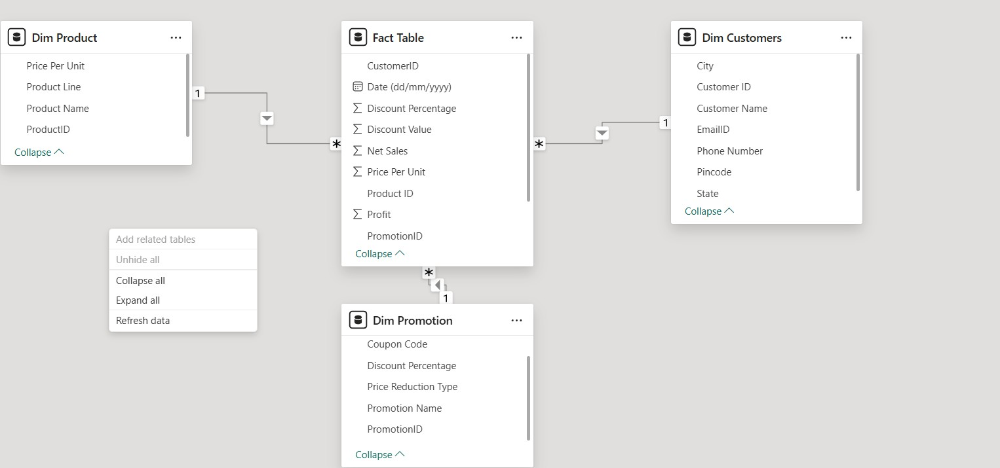
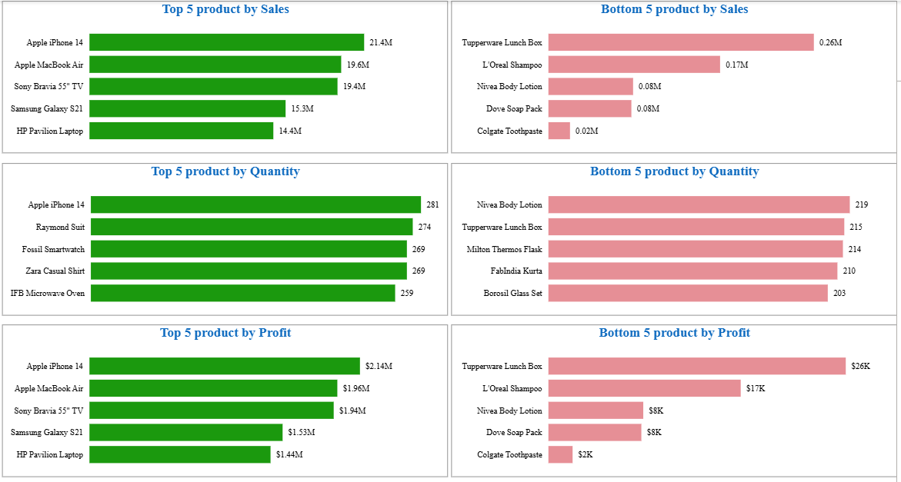
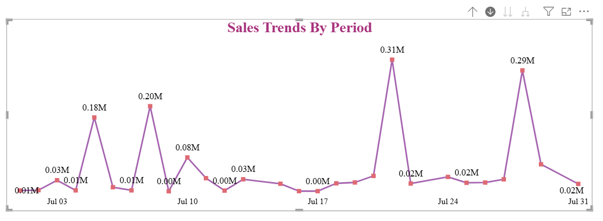
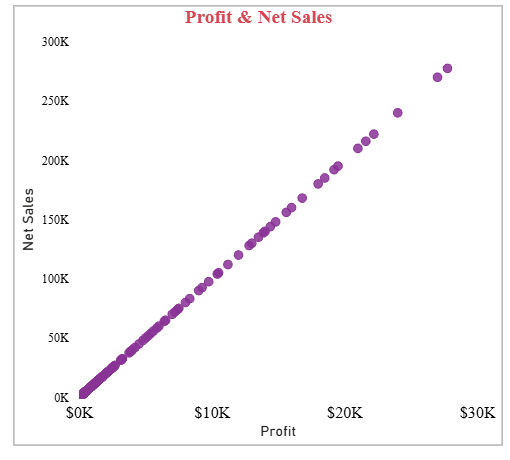
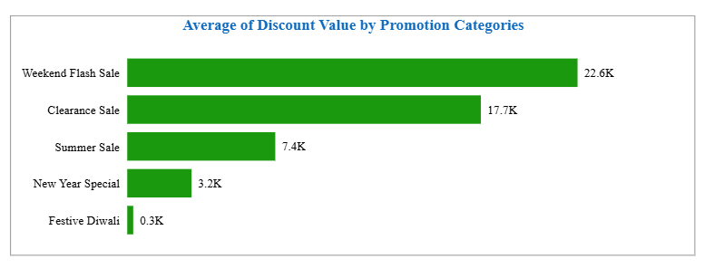
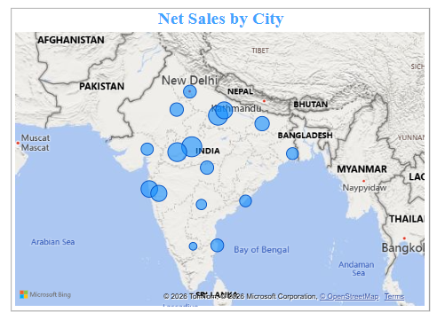
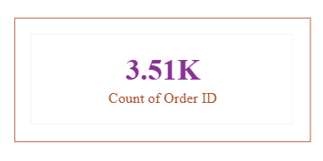

# Power BI Sales Data Analysis
Power BI Project 1: Sales Data Analysis (Covers Data Modeling Concepts)

## Overview
This project analyzes sales data in Power BI and focuses on data modeling concepts, DAX calculations, and interactive dashboard design.

## Tools Used
- Power BI
- Excel

## Dataset
The dataset used in this project is included in the repository as `Store+Data.xlsx`.

## Data Preparation
After loading the dataset into Power BI, the data preparation phase began through data transformation. This included checking data types, potential primary keys, null values, headers, and table names.

For example, since `Customer ID` is a potential primary key, its data type was changed from **Whole Number** to **Text**. In addition, in the `Dim Promotion` table, the `Price Reduction Type` column was converted into numerical values by creating a new column.

Missing values in Sheet3, which was later renamed to the **Fact table**, can also be handled using calculations. For example:

`Net Sales = Total Sales - Discount Value`

## Data Modeling
After the preparation phase, the data model and relationships between the Fact Table and Dimension tables were reviewed and organized into a star schema.

The model consists of a central **Fact Table** connected to the **Dim Product**, **Dim Customers**, and **Dim Promotion** tables through one-to-many relationships. This structure helps reduce redundancy and makes analysis more efficient.

### Data Model

## Business Questions

### 1. Top/Bottom 5 Analysis by Sales, Profit, and Quantity Sold
To answer this question, bar charts were created for the top and bottom 5 products based on **Sales**, **Quantity Sold**, and **Profit**.

Since the original dataset did not contain a `Profit` column, a new custom column was created in the **Fact Table**, where profit was assumed to be **10% of Net Sales**.

To display the results, the visuals were filtered by **Product Name** using the **Top N** filter instead of basic filtering.

### 2. How do sales trends vary over time (daily, monthly, quarterly, annually)?
A line chart was used to analyze sales trends over time. By using the drill feature, the visual can show sales performance at different time levels, such as daily, monthly, quarterly, and annually.

### 3. Show the relationship between sales & profit.
A scatter plot was used to visualize the relationship between **Net Sales** and **Profit**. Scatter plots are useful for showing the relationship between two numerical variables and for identifying patterns or correlations in the data.

### 4. Average discount offered in each discount category
A bar chart was used to compare the average discount value across different promotion categories. This helps identify which discount categories offer higher average discounts.

### 5. How do sales vary across different cities?
A map visual was used to show the distribution of **Net Sales** across different cities. The size of each bubble represents the sales value in that city, making it easier to compare geographical sales performance.

### 6. Total number of orders
To calculate the total number of orders, an index column was first added to the **Fact Table**. A card visual was then used to display the **distinct count** of that column, providing the total number of orders in the dataset.

## Acknowledgment
This project is based on **Section 23: Power BI Project 1, Sales Data Analysis (Covers Data Modeling Concepts)** from the Udemy course **Complete Data Analyst Bootcamp From Basics To Advanced**.

The implementation, report building, and documentation in this repository were completed by me as part of my learning and portfolio work.
